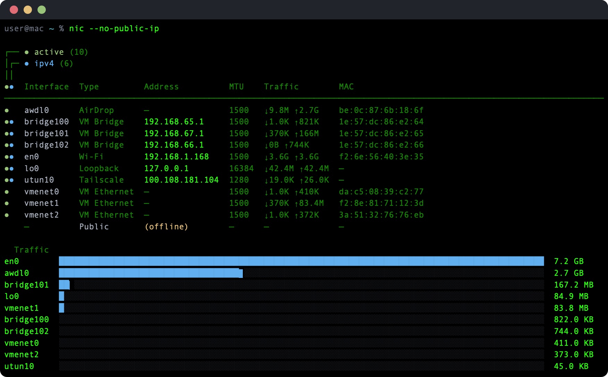
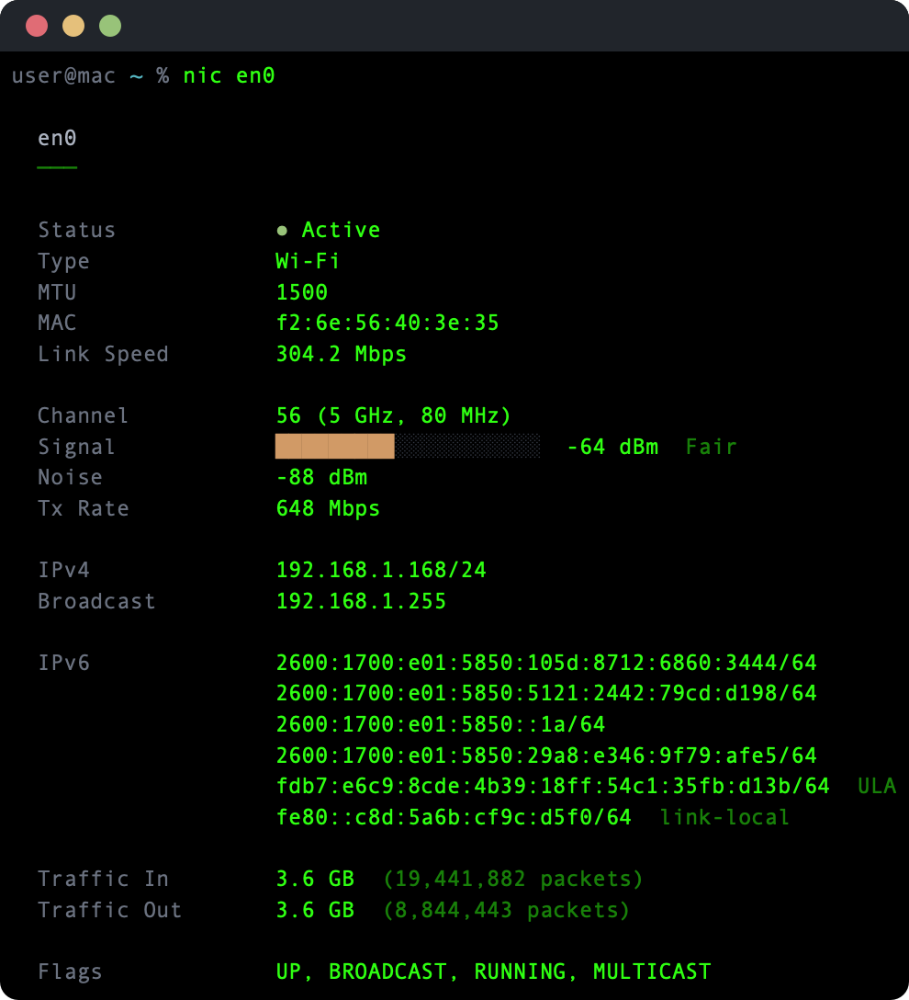

# nic


Show network interfaces and addresses on macOS with traffic stats, Wi-Fi details, and interface classification.



## What it does

`nic` replaces `ifconfig` with a focused, color-coded summary of every network interface on the machine. Active interfaces sort to the top with traffic light indicators for status and IPv4 connectivity. A bar chart shows relative traffic volume across interfaces.

Each interface is classified by type — Wi-Fi, Ethernet, Tailscale, VM Bridge, AirDrop, Loopback, and more — based on naming conventions and CoreWLAN queries. Wi-Fi interfaces include signal strength, SSID, channel, and transmit rate.

The detail view shows full addressing (IPv4 + IPv6 with scope labels), traffic counters, link speed, MAC address, and interface flags.

### Detail view



## Install

Requires Swift 6.0+ and macOS 14+. Depends on [swift-cli-core](https://github.com/ansilithic/swift-cli-core) and [swift-argument-parser](https://github.com/apple/swift-argument-parser).

```sh
git clone https://github.com/ansilithic/nic.git
cd nic
make build && make install
```

The binary installs to `/usr/local/bin/nic`. Verify with:

```sh
nic --version
```

## Usage

```
nic [interface] [options]
```

| Flag | Description |
|---|---|
| `-a, --all` | Include inactive interfaces |
| `--json` | Output as JSON |
| `--no-public-ip` | Skip public IP lookup |
| `<interface>` | Show full detail for a specific interface |

## Examples

```sh
# Default view — active interfaces with traffic chart
nic

# All interfaces including inactive
nic -a

# Detail view for a specific interface
nic en0

# JSON output for scripting
nic --json

# JSON detail for a single interface
nic en0 --json
```

## License

MIT
